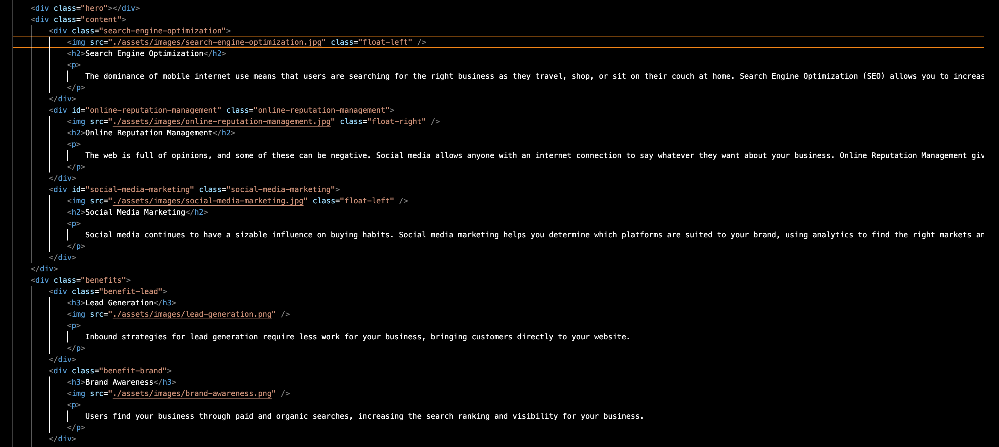
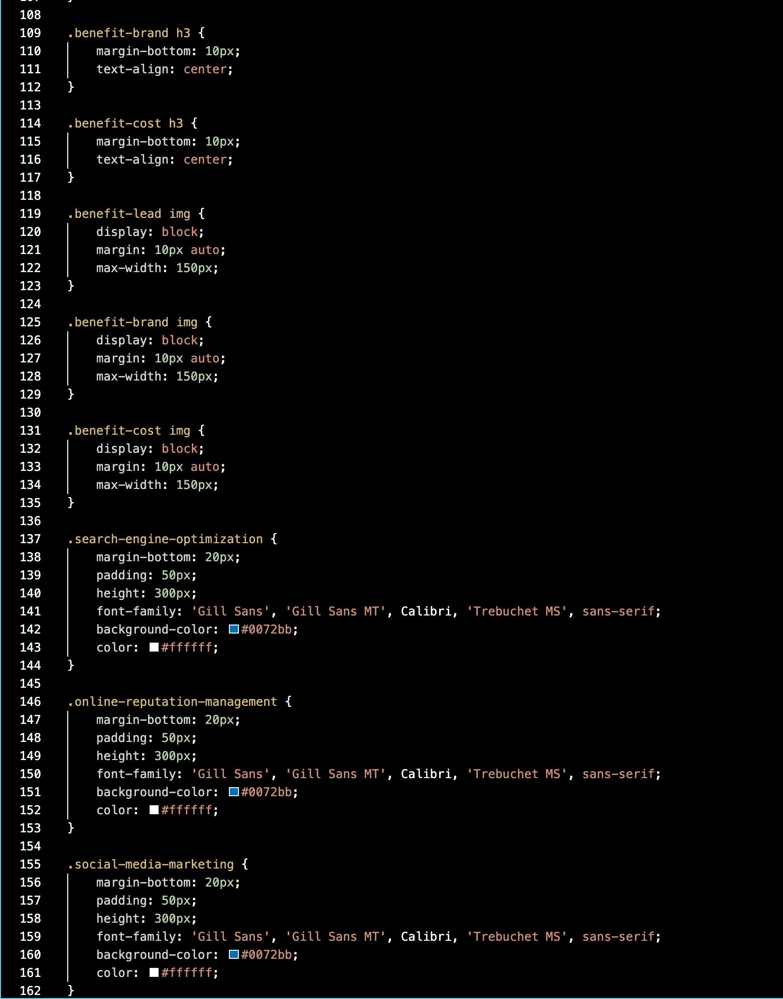

# Homework 1 Refactoring Code

## Project Goals

The goal of this assignment was to make a given html more semantic and clean up the corresponding CSS.


The given HTML had a lot of div elements and excessive use of id and classes. In certain sections, an id and class of the same name was applied to each of the sections.
 



The CSS was also full of duplicated styling and wasn't following best practices. Rather than selecting a class that would cover a number of parts of the site, the CSS was styling each part by id, one by one.




## What's different?

#### HTML

The first step to make the code more semantic was to change all of the div elements to semantic elements. An example was changing ``` <div class = "header"> </div>``` into ``` <header> </header> ```

Other semantic elements that are now being used rather than the ``` <div> ``` are ``` <main> ``` for the main content on the page ```<nav> ``` for the nav bar at the top and ```  <aside> ``` for the sidebar that is shown on the right side. I also added many ``` <section> ``` elements for the different sections of the html. 

My personal goal for the HTML was to take out as many of the div elements as possible and replace them with semantic. 

The second step to improving the HTML was getting rid of the duplicated class and id names for each section. I left the id to reflect the individual parts in case someone in the future needed to alter a specific section of the website, but took out the class. 

Throughout the process I also added comments about what I changed to keep track of what I needed to change in the CSS.

#### CSS
 
The first thing I did to the CSS after altering the HTML was to update the styling to reflect the new semantic elements. 

Once the selectors were updated the CSS's main issue was the repeated styling for each individual part. I started by consolidating as much of the similar code as possible. 

Rather than repeating the same styling for each section with the id, I used the new semantic elements to select the correct parts of the page. An example of this was rather than naming the sidebar section as ".benefits" when it was ``` <div class = benefits> ``` the new selector became either ``` aside {} ``` to select the entire side bar, or ``` aside section {} ``` to select the individual parts of the sidebar without selecting each individual id. 

The last part was commenting the CSS to show exactly what each selector is referring to.


### Link to deployed application:

 https://lauraantunez024.github.io/HW1-Refactoringcode/

### Credits 

Project was created as part of an assignment for Georgia Tech Coding Bootcamp